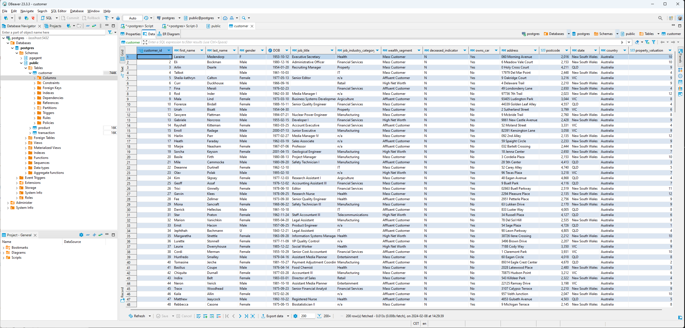

# Курс "Системы хранения и обработки данных"

## Домашнее задание 1. Создание и нормализация базы данных

## Пункты задания:

### Продумать структуру базы данных и отрисовать в редакторе.

[Database structure](db_structure.txt)

###  Нормализовать базу данных (1НФ — 3НФ), описав, к какой нормальной форме приводится таблица и почему таблица в этой нормальной форме изначально не находилась.

**Предварительный анализ таблиц:**

Начальный анализ данных делался в Pandas, ссылка на ноутбук: [EDA.ipynb](EDA.ipynb)

В исходном виде таблица находилась в 1НФ - все атрибуты в таблице являются простыми, все сохраняемые данные на пересечении столбцов и строк содержат только скалярные значения.

2НФ таблица уже не соответствовала, поскольку хватало столбцов, не являющихся ключом и не зависящих от первичного ключа (номера транзакции)

**Для приведения к 3НФ решено было выделить три таблицы - продукты, клиенты и транзакции.**

Для того, чтобы сделать каждый продукт из таблицы product уникальным, необходимо было сделать составной ключ на основе ряда признаков. Оказалось, что для получения уникального значения нужно взять следующую комбинацию признаков: ['product_id', 'brand', 'product_line', 'product_class', 'product_size', 'list_price', 'standard_cost'].

*Примечание:* можно было бы цену считать свойством транзакции (ну например в зависимости от даты цена могла меняться, или программы скидок для конкретных клиентов), и тогда оставить ее в таблице с транзакциями, но для некоторых продуктов с product_id = 0 есть записи, в которых из дополнительных данных для продукта - только стоимость, поэтому по такому пути я решил не идти. 

Еще оказалось, что в таблице с транзакциями есть клиент с customer_id, для которого нет в таблице с клиентами. Поскольку условия задания позволяли не импортировать все записи, эти три транзакции были удалены из данных.

*Выбор типов* Ряд колонок можно было бы перевести в справочники (state) или в булевые переменные (owns_car), но поскольку задачи такой не стояло, плюс кое-где есть пропущенные значения, оставил их в виде varchar.

### Создать все таблицы в DBeaver, указав первичные ключи к таблицам, правильные типы данных, могут ли поля быть пустыми или нет (использовать команду CREATE TABLE).

Скрипт для создания таблиц: [scripts.sql](scripts.sql)

### Загрузить данные в таблицы в соответствии с созданной структурой (использовать команду INSERT INTO или загрузить файлы, используя возможности инструмента DBeaver; в случае загрузки файлами приложить скрины, что данные действительно были залиты).

Все таблицы CSV были подготовлены с помощью Pandas, а потом загружены через интерфейс DBraver. 

**Скриншоты**

Customers: 

Products: 

Transactions: 