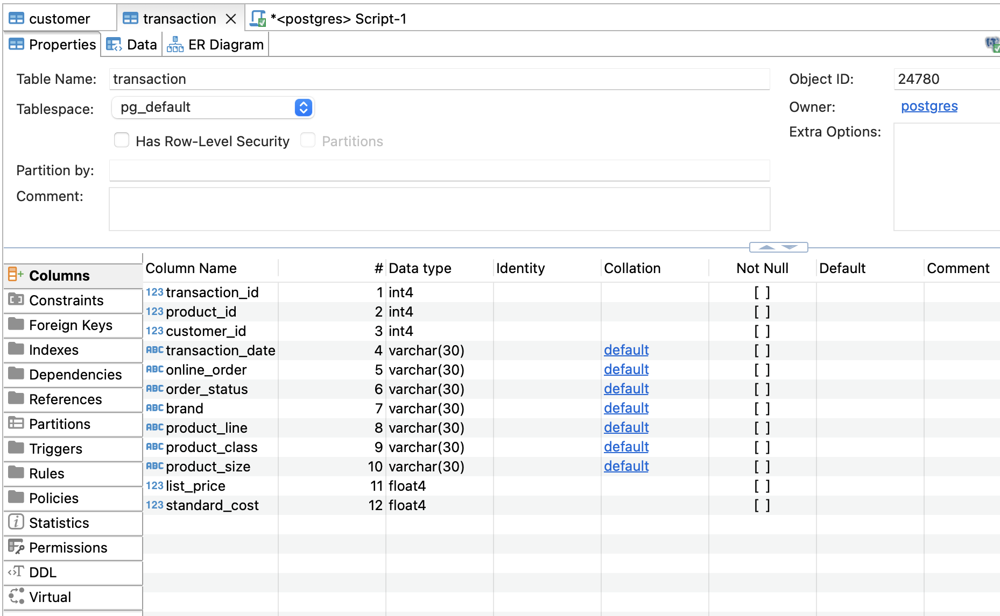
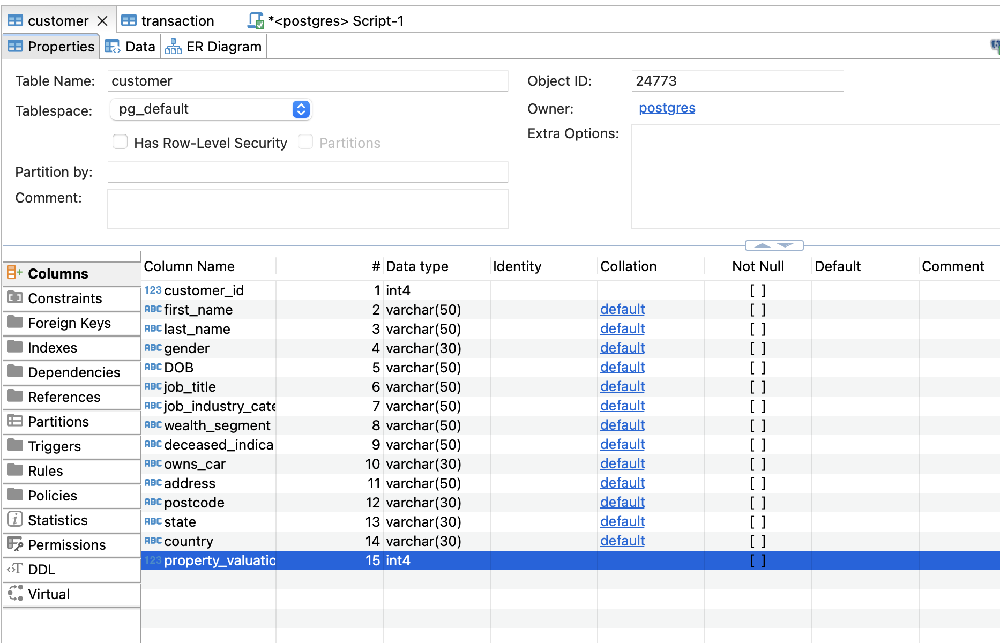
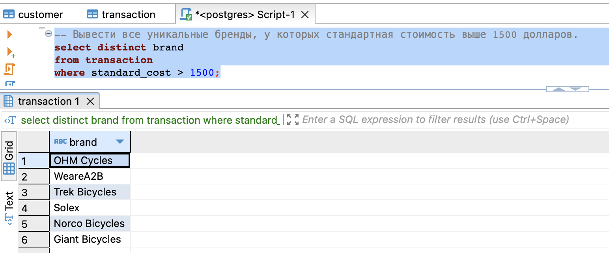
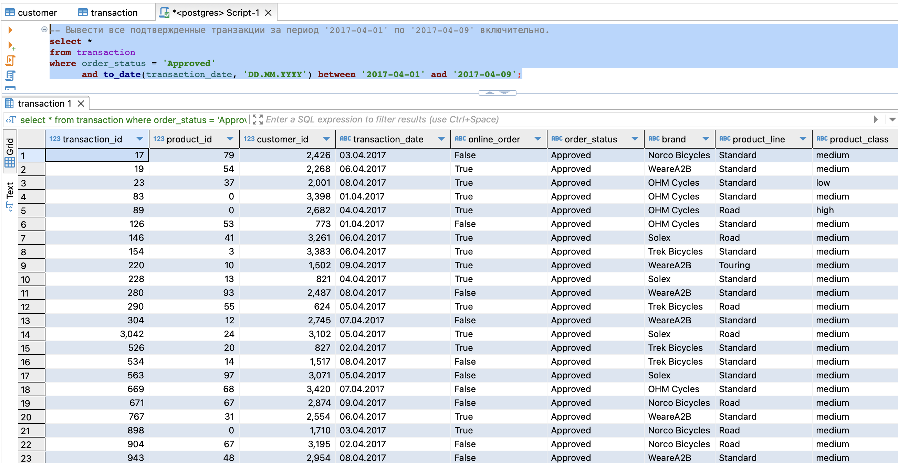
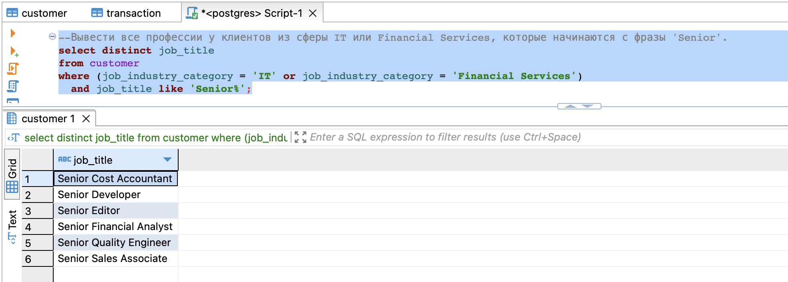
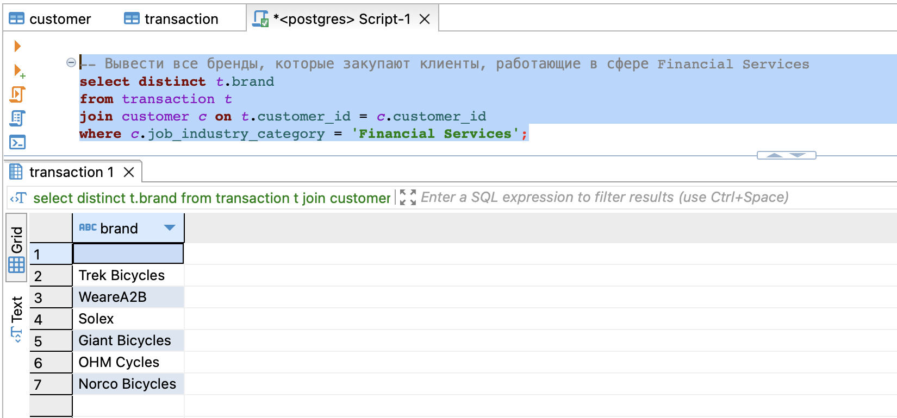
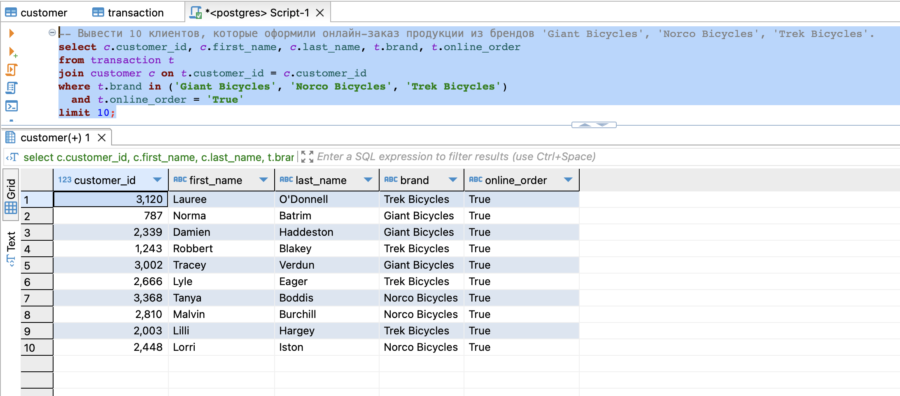
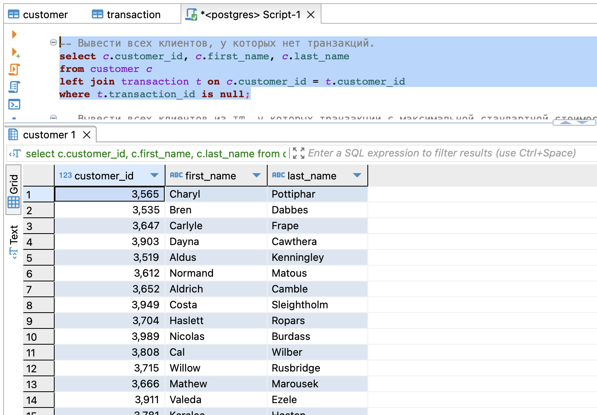
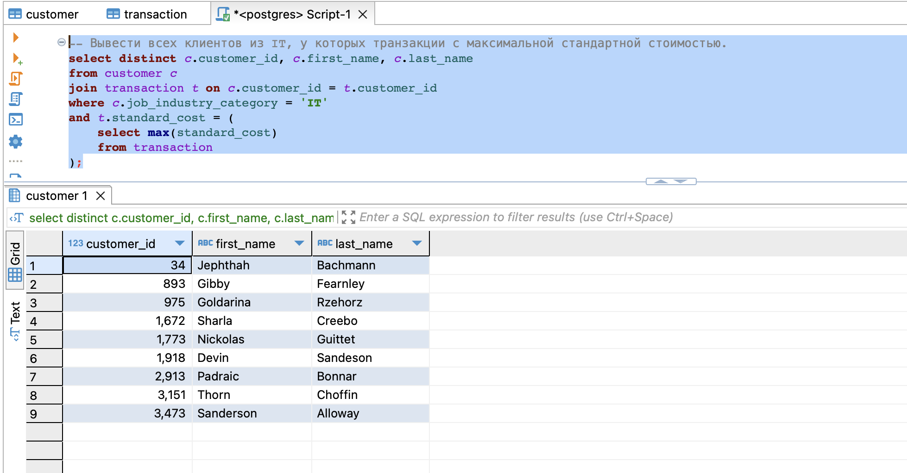
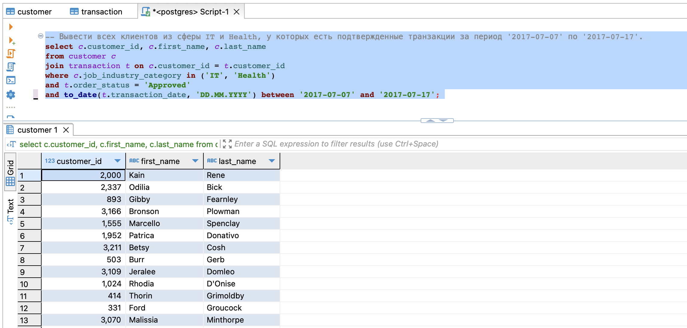

# Курс "Системы хранения и обработки данных"

## Домашнее задание 2. Основные операторы PostgreSQL

## Пункты задания:

### Создать таблицы со следующими структурами и загрузить данные из csv-файлов. 

Все скрипты для выполнения последующих заданий есть в файле [script.sql](script.sql)
Проверка данных (первый несколько запросов [script.sql](script.sql)) показала, что есть проблема с customer_id 5034, его нет в таблице customer, а в transaction для него есть три транзакции. Потенциально эти транзакции можно удалить (например, как это было сделано в первом домашнем задании), но на результат отработки запросов это не повлияло. 

### Вывести все уникальные бренды, у которых стандартная стоимость выше 1500 долларов.

### Вывести все подтвержденные транзакции за период '2017-04-01' по '2017-04-09' включительно.

### Вывести все профессии у клиентов из сферы IT или Financial Services, которые начинаются с фразы 'Senior'.

### Вывести все бренды, которые закупают клиенты, работающие в сфере Financial Services

### Вывести 10 клиентов, которые оформили онлайн-заказ продукции из брендов 'Giant Bicycles', 'Norco Bicycles', 'Trek Bicycles'.

### Вывести всех клиентов, у которых нет транзакций.

### Вывести всех клиентов из IT, у которых транзакции с максимальной стандартной стоимостью.

### Вывести всех клиентов из сферы IT и Health, у которых есть подтвержденные транзакции за период '2017-07-07' по '2017-07-17'.

