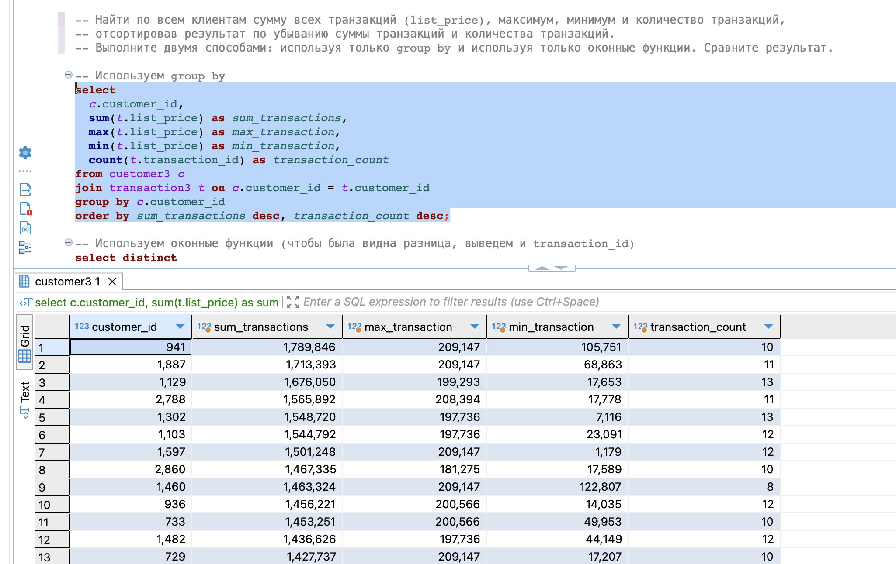
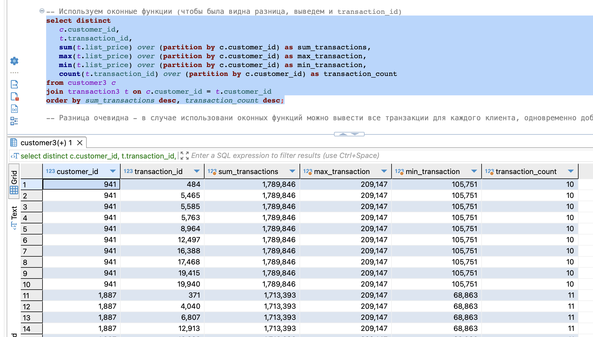
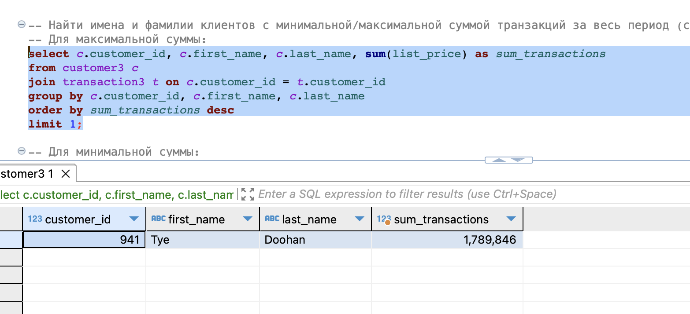
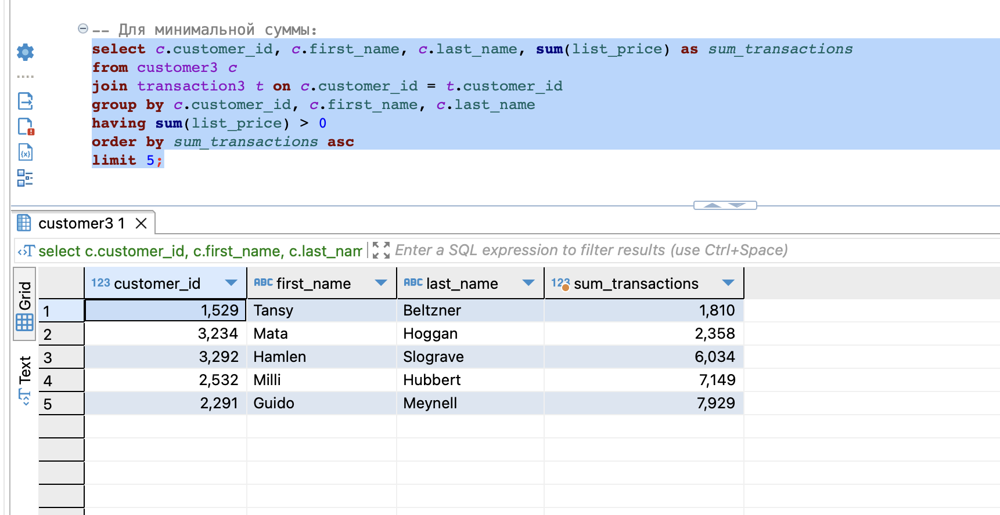

# Курс "Системы хранения и обработки данных"

## Домашнее задание 3. Оконные функции

## Пункты задания:

### Создать таблицы со следующими структурами и загрузить данные из csv-файлов. 

Все скрипты для выполнения последующих заданий есть в файле [script.sql](script.sql)
Проверка данных (первый несколько запросов [script.sql](script.sql)) показала, что есть проблема с customer_id 5034, его нет в таблице customer, а в transaction для него есть три транзакции. Потенциально эти транзакции можно удалить (например, как это было сделано в первом домашнем задании), но на результат отработки запросов это не повлияло. 

### Вывести распределение (количество) клиентов по сферам деятельности, отсортировав результат по убыванию количества.

### Найти сумму транзакций за каждый месяц по сферам деятельности, отсортировав по месяцам и по сфере деятельности. 

### Вывести количество онлайн-заказов для всех брендов в рамках подтвержденных заказов клиентов из сферы IT. 

### Найти по всем клиентам сумму всех транзакций (list_price), максимум, минимум и количество транзакций, отсортировав результат по убыванию суммы транзакций и количества транзакций. Выполните двумя способами: используя только group by и используя только оконные функции. Сравните результат.

Разница очевидна - в случае использовани оконных функций можно вывести все транзакции для каждого клиента, одновременно добавив результаты оконных функций

### Найти имена и фамилии клиентов с минимальной/максимальной суммой транзакций за весь период (сумма транзакций не может быть null). Напишите отдельные запросы для минимальной и максимальной суммы. 
Для максимальной суммы:

Для минимальной суммы (для разнообразия выведем пять, можно уменьшить поменяв лимит):

### Вывести только самые первые транзакции клиентов. Решить с помощью оконных функций.

### Вывести имена, фамилии и профессии клиентов, между транзакциями которых был максимальный интервал (интервал вычисляется в днях)

